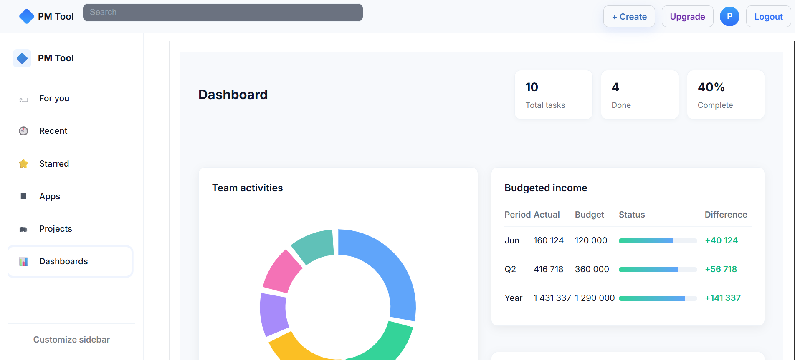

# Project-Management-Tool
I am building a project management tool that keeps everything organized without the headache. 
You can track tasks, set deadlines, and see what everyone’s working on—all in one place. 
It’s simple, clean, and actually makes managing projects feel less like work and more like, ‘I’ve got this.
Unfortunately , This is still a work in progess.
## 🚀 Live Demo

You can check out the production build here:

🔗 **https://project-management-toolkit-dnsq.vercel.app**

## Screenshots

### Dashboard

### Projects

